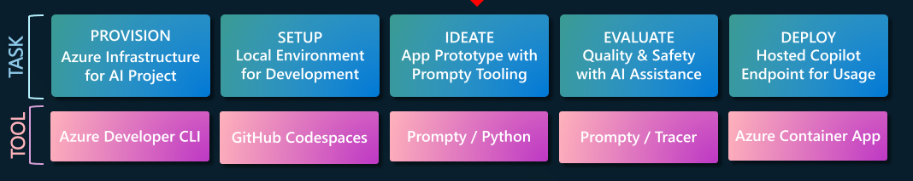

# Build Intelligent Apps

The [Build Intelligent Apps](https://aka.ms/FallForIA) initiative is a bi-annual event at Microsoft, showcasing the latest AI tools, technologies and solutions through a series of content-driven initiatives.
This repository and associated site documents my contributions to the initiative over the years.

## Sep 2024 

To be published in **Week 3** of the [#30DaysOfIA](https://azure.github.io/Cloud-Native/30-days-of-ia-2024/kick-off) 
content series. Focus on the [Building a Retail Copilot Code-First on Azure AI](https://aka.ms/aitour/contoso-chat/workshop) workshop from the ongoing [Microsoft AI Tour](https://aka.ms/aitour) - showing developers how to provision, build, evaluate, deploy and operationalize a retail AI solution on Azure AI Studio.

🚨 | _Links will be updated when published_.

| Day | Title | 
| --- | ----- | 
| 1️⃣ | [Design It - Retail Copilot Code-First On Azure AI Studio]() | Application Scenario · RAG Design Pattern · Azure AI Architecture · GenAIOps · E2E Dev Workflow |
| 2️⃣ | [Provision It - with Azure Developer CLI]() | Azure AI Templates · Azure Developer CLI · GitHub Tooling · VS Code|
| 3️⃣ | [Prototype It - with Prompty and Azure AI Studio]() | Prompty Structure · Tooling & Execution · Observability |
| 4️⃣ | [Evaluate It - with custom evaluators and AI assistance]() | Quality & Safety Metrics · Evaluation Flow · Tracing · Automation  |
| 5️⃣ | [Deploy It - With Azure Container Apps and FastAPI](https://aka.ms/FallForIA) | FastAPI application · Local Testing · ACA Deployment · Contoso Web  |
| 6️⃣ | [Operationalize It - with Monitoring & Safety](https://aka.ms/FallForIA) | How AI is transforming the manufacturing industry |
| 6️⃣ | [Reuse It - explore Model Choice, Design Patterns](https://aka.ms/FallForIA) |  |
|||

## Feb 2024 

Published in **Week 4** of the [#60DaysOfIA](https://azure.github.io/Cloud-Native/60DaysOfIA/kick-off) content series that ran from Feb-Apr 2024. First iteration of [Contoso Chat](https://aka.ms/aitour/contoso-chat) sample with deployment to Azure AI Studio endpoint (with Azure AI Studio preview).

| Day | Title | 
| --- | ----- | 
| 1️⃣ | [Fuel Your Intelligent Apps with Azure AI](https://azure.github.io/Cloud-Native/60DaysOfIA/fuel-your-intelligent-apps-with-azure-ai) | 
| 2️⃣ | [Build Contoso Chat End-to-End](https://azure.github.io/Cloud-Native/60DaysOfIA/build-contoso-chat-end-to-end) | 
| 3️⃣ | [Build A Copilot Code-First with the Azure AI Python SDK](https://azure.github.io/Cloud-Native/60DaysOfIA/build-a-copilot-code-first-with-the-azure-ai-python-sdk) 
| 4️⃣ | [Build a Copilot on Azure Code-First with Prompt Flow](https://azure.github.io/Cloud-Native/60DaysOfIA/build-a-copilot-on-azure-code-first-with-prompt-flow) |
| 5️⃣ | [Build a Copilot on Azure Code-First with Langchain](https://azure.github.io/Cloud-Native/60DaysOfIA/build-a-copilot-on-azure-code-first-with-langchain) |
| 6️⃣ | [Deploying Your Copilot On Azure](https://azure.github.io/Cloud-Native/60DaysOfIA/deploying-your-copilot-on-azure) |
| | |